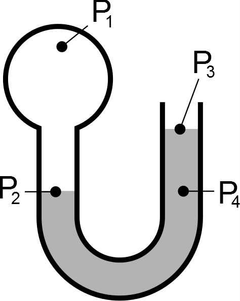

# Acceleration and Newton's 2nd Law

An elevator suspended by a vertical cable is moving downward but speeding up. The tension in the cable must be:

## Answer

1. Greater than the weight of the elevator
2. Equal to the weight of the elevator
3. Less than the weight of the elevator #*
4. Not enough information to tell	

# Pressure in a mannometer

In the system below some gas is trapped in one end of a u-shaped tube. Considering the pressures at 4 points marked on the diagram, which of the following is true?

## Answer

1. \\(P_1 = P_2 = P_3 = P_4 \\)
2. \\(P_1 \gt P_2 \gt P_3 = P_4 \\)
3. \\(P_1 = P_2 \gt P_3 \gt P_4 \\)
4. \\(P_1 = P_2 = P_3 \gt P_4 \\) #100

# Circular motion

True or false: An object moving in a circle with _constant_ speed no acceleration.

## Answer

1. False "Correct"
2. "Circular motion requires centripetal acceleration"

# Rocket sled

A 20kg sled is travelling on a horizontal, frictionless track at 5m/s. A rocket mounted on the sled burns for 3 seconds producing a force of 1000N. What is the velocity of the sled after the 3s? (in m/s)

## Answer

* 155 {1} "Correct"

# Flowing fluids

What type of flow occurs for systems with very high Reynold's numbers.

## Answer

* Turbulent 

